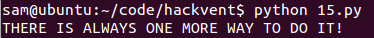

Hackvent consists of a series of hacking challenges released one per day in the run up to Christmas, hence the name...

I've been too busy to put much time in this year but the challenge for day 15 was designed to be solved with Z3 and once a friend linked me to it ([http://hackvent.hacking-lab.com/challenge.php?day=15](http://hackvent.hacking-lab.com/challenge.php?day=15)), I was well and truly [nerd sniped](https://xkcd.com/356/) and had to solve it.

The challenge starts by telling us:

<pre>
We've captured a strange message. It looks like it is encrypted somehow ...
iw, hu, fv, lu, dv, cy, og, lc, gy, fq, od, lo, fq, is, ig, gu, hs, hi, ds, cy, oo, os, iu, fs, gu, lh, dq, lv, gu, iw, hv, gu, di, hs, cy, oc, iw, gc

We've also intercepted what seems to be a hint to the key:
bytwycju + yzvyjjdy ^ vugljtyn + ugdztnwv | xbfziozy = bzuwtwol
    ^         ^          ^          ^          ^
wwnnnqbw - uclfqvdu & oncycbxh | oqcnwbsd ^ cgyoyfjg = vyhyjivb
    &         &          &          &          &
yzdgotby | oigsjgoj | ttligxut - dhcqxtfw & szblgodf = sfgsoxdd
    +         +          +          +          +
yjjowdqh & niiqztgs + ctvtwysu & diffhlnl - thhwohwn = xsvuojtx
    -         -           -         -          -
nttuhlnq ^ oqbctlzh - nshtztns ^ htwizvwi + udluvhcz = syhjizjq
    =         =           =         =          =         
fjivucti   zoljwdfl   sugvqgww   uxztiywn   jqxizzxq
</pre>

It also gives us a few hints:

<pre>
Notes
<ul><li>assume q != 0 </li>
<li>a letter is a decimal digit is a letter </li>
<li>each digit has exactly two different letter representations</li>
<li>C-like operator precedence</li>
<li>To be clear: abcd = a*1000 + b*100 + c*10 + d*1</li>
<li>Hint 1: Z3 solver can save your day!</li> </ul>
</pre>

The hint telling us to use Z3 makes it clear that we need to treat this as a constraint solving problem, using the hints and equations we have been given we can create constraints on symbolic representations of the letter variables and then Z3 can find valid values for them.

Once I had worked out the approach needed the first thing to do was generate the letter variables and all those expanded variables, I decided to automate this with a simple python script.

First of all I copy pasted the grid of equations and deleted stuff and added quotes and commas until I had a python list of all the expanded variable names as strings:

<pre>
var = ['bytwycju','yzvyjjdy','vugljtyn','ugdztnwv','xbfziozy','bzuwtwol',
'wwnnnqbw','uclfqvdu','oncycbxh','oqcnwbsd','cgyoyfjg','vyhyjivb',
'yzdgotby','oigsjgoj','ttligxut','dhcqxtfw','szblgodf','sfgsoxdd',
'yjjowdqh','niiqztgs','ctvtwysu','diffhlnl','thhwohwn','xsvuojtx',
'nttuhlnq','oqbctlzh','nshtztns','htwizvwi','udluvhcz','syhjizjq','fjivucti','zoljwdfl','sugvqgww','uxztiywn','jqxizzxq']
</pre>

Next I wrote some code to iterate over every character in each string of the var list and create a Set of the unique letters used:

<pre>
s = set()
for i in var:
	for c in i:
		s.add(c)
</pre>

Once we have this we can write code to generate a symbolic variable for each of the one letter vars:

<pre>
for c in s:
	print c + " = BitVec('" + c + "',32)"
</pre>

Each letter is a declared as a 32 bit symbolic bit vector with corresponding name.

Next the code prints out an instantiation of a Solver() and begins adding the constraint from the earlier notes that each letter only has a value between 0 and 10:

<pre>
print "solv = Solver()"

for c in s:
	print "solv.append(" + c + " < 10, " + c + " >= 0)"
</pre>

With the exception of 'q' of course for which I just deleted the '=' from the '>= 0' part after copy pasting the scripts output into my actual solving script later on. Next I created all of the complex variables that appear in the simultaneous equations:

<pre>
for i in var:
	out = ""
	out += i + "="
	i = list(reversed(i))
	for c in range(0,len(i)):
		out+= i[c] + "*1" + "0"*c +"+"
	print out[:-1]
</pre>

From the rules given to us earlier, we know that 'jqxizzxq' should be equivalent to: 'q*1+x*10+z*100+z*1000+i*10000+x*100000+q*1000000+j*10000000' which is what this section of code prints out.

Now I can run this script, which I called [generate.py](https://github.com/sam-b/z3-stuff/blob/master/hackvent-15/generate.py), and it will output most of the code that is needed: 

<pre>
sam@ubuntu:~/code/hackvent$ python generate.py 
c = BitVec('c',32)
b = BitVec('b',32)
d = BitVec('d',32)
g = BitVec('g',32)
f = BitVec('f',32)
i = BitVec('i',32)
h = BitVec('h',32)
j = BitVec('j',32)
l = BitVec('l',32)
o = BitVec('o',32)
n = BitVec('n',32)
q = BitVec('q',32)
s = BitVec('s',32)
u = BitVec('u',32)
t = BitVec('t',32)
w = BitVec('w',32)
v = BitVec('v',32)
y = BitVec('y',32)
x = BitVec('x',32)
z = BitVec('z',32)
solv = Solver()
solv.append(c < 10, c >= 0)
solv.append(b < 10, b >= 0)
solv.append(d < 10, d >= 0)
solv.append(g < 10, g >= 0)
solv.append(f < 10, f >= 0)
solv.append(i < 10, i >= 0)
solv.append(h < 10, h >= 0)
solv.append(j < 10, j >= 0)
solv.append(l < 10, l >= 0)
solv.append(o < 10, o >= 0)
solv.append(n < 10, n >= 0)
solv.append(q < 10, q >= 0)
solv.append(s < 10, s >= 0)
solv.append(u < 10, u >= 0)
solv.append(t < 10, t >= 0)
solv.append(w < 10, w >= 0)
solv.append(v < 10, v >= 0)
solv.append(y < 10, y >= 0)
solv.append(x < 10, x >= 0)
solv.append(z < 10, z >= 0)
bytwycju=u*1+j*10+c*100+y*1000+w*10000+t*100000+y*1000000+b*10000000
yzvyjjdy=y*1+d*10+j*100+j*1000+y*10000+v*100000+z*1000000+y*10000000
vugljtyn=n*1+y*10+t*100+j*1000+l*10000+g*100000+u*1000000+v*10000000
ugdztnwv=v*1+w*10+n*100+t*1000+z*10000+d*100000+g*1000000+u*10000000
xbfziozy=y*1+z*10+o*100+i*1000+z*10000+f*100000+b*1000000+x*10000000
bzuwtwol=l*1+o*10+w*100+t*1000+w*10000+u*100000+z*1000000+b*10000000
wwnnnqbw=w*1+b*10+q*100+n*1000+n*10000+n*100000+w*1000000+w*10000000
uclfqvdu=u*1+d*10+v*100+q*1000+f*10000+l*100000+c*1000000+u*10000000
oncycbxh=h*1+x*10+b*100+c*1000+y*10000+c*100000+n*1000000+o*10000000
oqcnwbsd=d*1+s*10+b*100+w*1000+n*10000+c*100000+q*1000000+o*10000000
cgyoyfjg=g*1+j*10+f*100+y*1000+o*10000+y*100000+g*1000000+c*10000000
vyhyjivb=b*1+v*10+i*100+j*1000+y*10000+h*100000+y*1000000+v*10000000
yzdgotby=y*1+b*10+t*100+o*1000+g*10000+d*100000+z*1000000+y*10000000
oigsjgoj=j*1+o*10+g*100+j*1000+s*10000+g*100000+i*1000000+o*10000000
ttligxut=t*1+u*10+x*100+g*1000+i*10000+l*100000+t*1000000+t*10000000
dhcqxtfw=w*1+f*10+t*100+x*1000+q*10000+c*100000+h*1000000+d*10000000
szblgodf=f*1+d*10+o*100+g*1000+l*10000+b*100000+z*1000000+s*10000000
sfgsoxdd=d*1+d*10+x*100+o*1000+s*10000+g*100000+f*1000000+s*10000000
yjjowdqh=h*1+q*10+d*100+w*1000+o*10000+j*100000+j*1000000+y*10000000
niiqztgs=s*1+g*10+t*100+z*1000+q*10000+i*100000+i*1000000+n*10000000
ctvtwysu=u*1+s*10+y*100+w*1000+t*10000+v*100000+t*1000000+c*10000000
diffhlnl=l*1+n*10+l*100+h*1000+f*10000+f*100000+i*1000000+d*10000000
thhwohwn=n*1+w*10+h*100+o*1000+w*10000+h*100000+h*1000000+t*10000000
xsvuojtx=x*1+t*10+j*100+o*1000+u*10000+v*100000+s*1000000+x*10000000
nttuhlnq=q*1+n*10+l*100+h*1000+u*10000+t*100000+t*1000000+n*10000000
oqbctlzh=h*1+z*10+l*100+t*1000+c*10000+b*100000+q*1000000+o*10000000
nshtztns=s*1+n*10+t*100+z*1000+t*10000+h*100000+s*1000000+n*10000000
htwizvwi=i*1+w*10+v*100+z*1000+i*10000+w*100000+t*1000000+h*10000000
udluvhcz=z*1+c*10+h*100+v*1000+u*10000+l*100000+d*1000000+u*10000000
syhjizjq=q*1+j*10+z*100+i*1000+j*10000+h*100000+y*1000000+s*10000000
fjivucti=i*1+t*10+c*100+u*1000+v*10000+i*100000+j*1000000+f*10000000
zoljwdfl=l*1+f*10+d*100+w*1000+j*10000+l*100000+o*1000000+z*10000000
sugvqgww=w*1+w*10+g*100+q*1000+v*10000+g*100000+u*1000000+s*10000000
uxztiywn=n*1+w*10+y*100+i*1000+t*10000+z*100000+x*1000000+u*10000000
jqxizzxq=q*1+x*10+z*100+z*1000+i*10000+x*100000+q*1000000+j*10000000
</pre>

I put a short stub of code in the file [15.py](https://github.com/sam-b/z3-stuff/blob/master/hackvent-15/15.py):

<pre>
from z3 import *  
import sys

encrypted = "iw, hu, fv, lu, dv, cy, og, lc, gy, fq, od, lo, fq, is, ig, gu, hs, hi, ds, cy, oo, os, iu, fs, gu, lh, dq, lv, gu, iw, hv, gu, di, hs, cy, oc, iw, gc"

if __name__ == "__main__": 

</pre>

Onto this I appended the output from [generate.py](https://github.com/sam-b/z3-stuff/blob/master/hackvent-15/generate.py), now I just needed to add the simultaneous equations as constraints and then parse the model generated by Z3 if the constraints can be satisfied. 

I added the equations as constraints by just copy pasting first horizontal and then the vertical lines from the grid of equations into 'solv.add()' calls. I could have scripted this as well but it didn't seem worth the effort when most of them can just be copy-pasted straight in:

<pre>
solv.add(bytwycju + yzvyjjdy ^ vugljtyn + ugdztnwv | xbfziozy == bzuwtwol)

solv.add(wwnnnqbw - uclfqvdu & oncycbxh | oqcnwbsd ^ cgyoyfjg == vyhyjivb)

solv.add(yzdgotby | oigsjgoj | ttligxut - dhcqxtfw & szblgodf == sfgsoxdd)

solv.add(yjjowdqh & niiqztgs + ctvtwysu & diffhlnl - thhwohwn == xsvuojtx)

solv.add(nttuhlnq ^ oqbctlzh - nshtztns ^ htwizvwi + udluvhcz == syhjizjq)

solv.add(bytwycju ^ wwnnnqbw & yzdgotby + yjjowdqh - nttuhlnq == fjivucti)

solv.add(yzvyjjdy ^ uclfqvdu & oigsjgoj + niiqztgs - oqbctlzh == zoljwdfl)

solv.add(vugljtyn ^ oncycbxh & ttligxut + ctvtwysu - nshtztns == sugvqgww)

solv.add(ugdztnwv ^ oqcnwbsd & dhcqxtfw + diffhlnl - htwizvwi == uxztiywn)

solv.add(xbfziozy ^ cgyoyfjg & 	szblgodf + thhwohwn - udluvhcz == jqxizzxq)
</pre>

Finally, I wrote code to first see if the constraints were satisfiable and if so, generate a model with the values for each letter in it. I then turned this into a python map which I use to convert the letters in the original 'encrypted' string into the corresponding integers. I guessed that the letter pairs would be ascii values and it turned out I was correct. So I cast each character pair to an int after conversion and then cast that into a char, all of which are appended together before being printed:

<pre>
model_map = {}
ascii = ""
if solv.check():
	model = solv.model()
	for i in model:
		model_map[str(i)] = str(model[i])
	for p in encrypted.split(', '):
		tmp = ""
		for c in p:
			tmp += model_map[c]
		ascii += chr(int(tmp))
	print ascii
else:
	print "unsat :("
</pre>

Finally I ran the code and it printed out the solution as expected!

