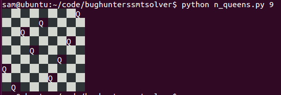

# N Queens

'How can N queens be placed on an NxN chessboard so that no two of them attack each other?'

When ran solution.py takes an integer argument and displays a solution to an placing 'n' Queen on an 'n' by 'n' chess board. Example output:

